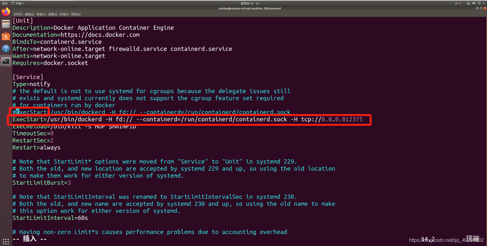
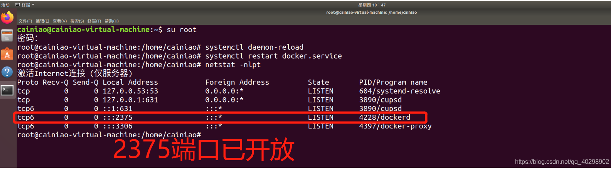
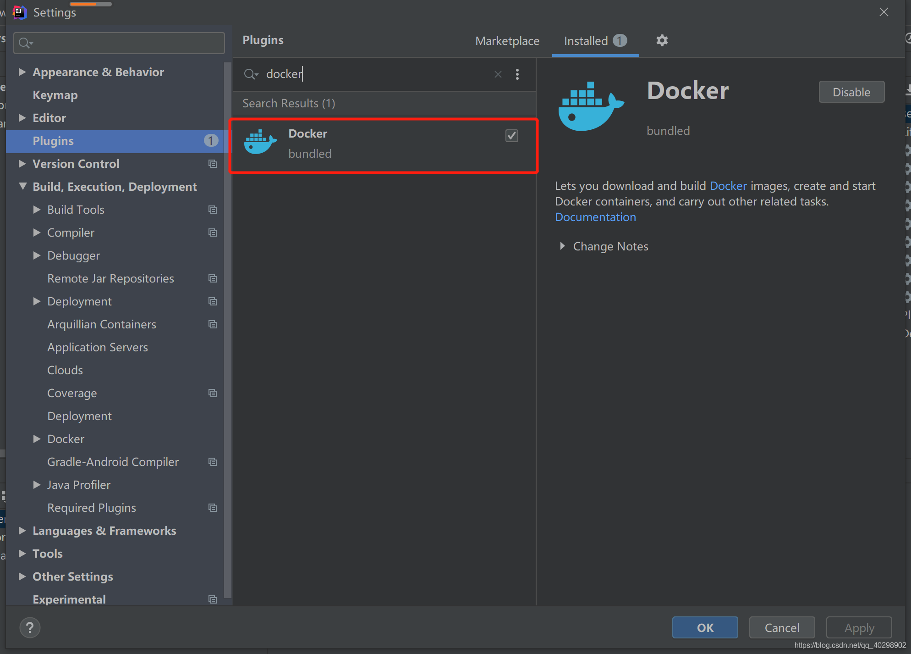
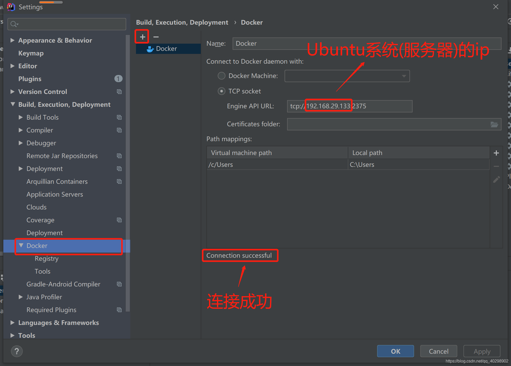
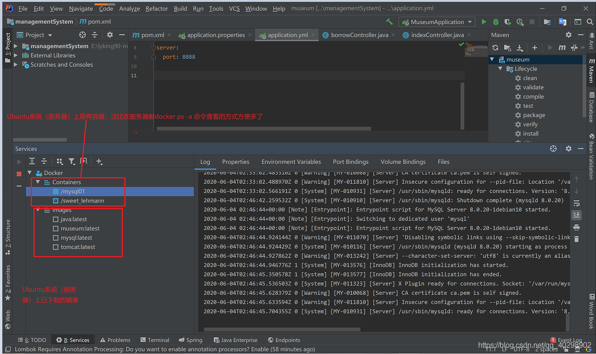
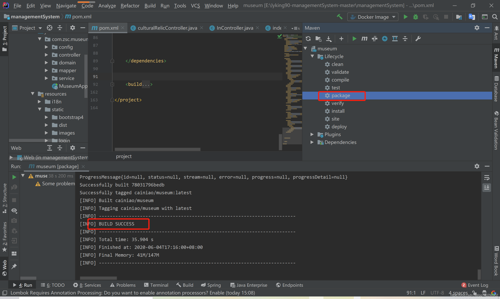
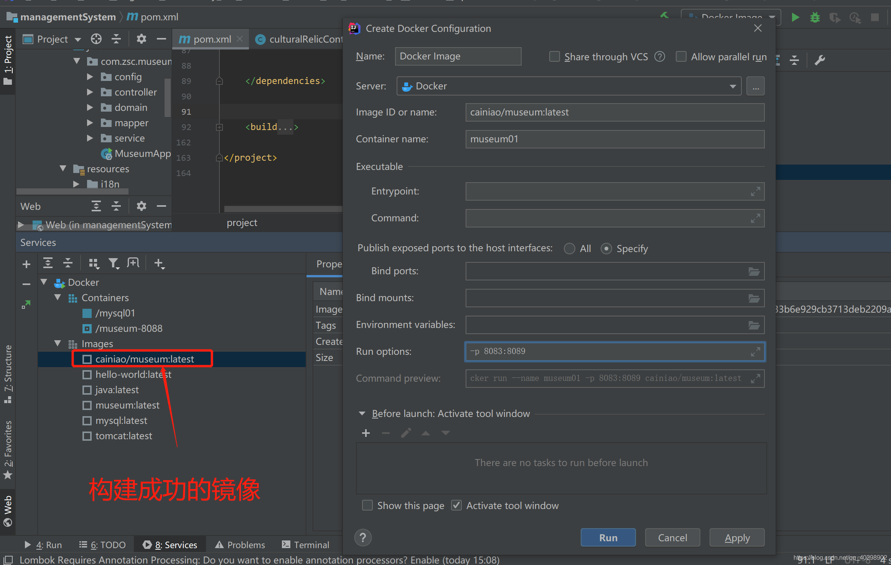
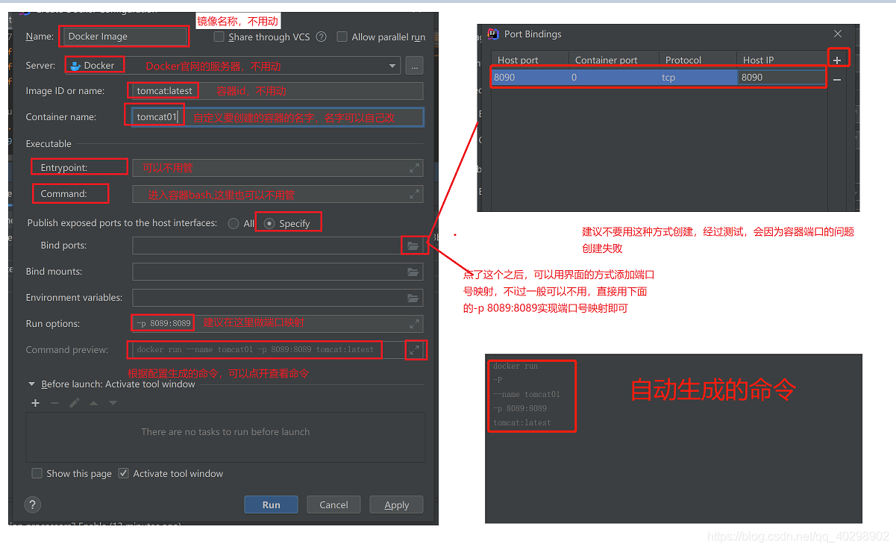

# 1.开启Docker远程访问

修改文件位置:`/lib/systemd/system/docker.service`

\#注释掉"ExecStart"这一行，并添加下面这一行信息

```
ExecStart=/usr/bin/dockerd -H fd:// --containerd=/run/containerd/containerd.sock -H tcp://0.0.0.0:2375
```



重启服务

```
#重新加载配置文件
systemctl daemon-reload
#重启服务
systemctl restart docker.service
#查看配置的端口号（2375）是否开启（非必要）
netstat -nlpt  #如果找不到netstat命令，可以先安装一下这个工具，具体百度
```




# 安装Docker插件








> 这样可以在IDEA中操作Docker


# Docker一键部署springboot

引入构建工具，在pom.xml文件中

```xml
<build>
    <plugins>
        <plugin>
            <groupId>org.springframework.boot</groupId>
            <artifactId>spring-boot-maven-plugin</artifactId>
        </plugin>
        <!--使用docker-maven-plugin插件-->
        <plugin>
            <groupId>com.spotify</groupId>
            <artifactId>docker-maven-plugin</artifactId>
            <version>1.0.0</version>
            <!--将插件绑定在某个phase执行-->
            <executions>
                <execution>
                    <id>build-image</id>
                    <!--用户只需执行mvn package ，就会自动执行mvn docker:build-->
                    <phase>package</phase>
                    <goals>
                        <goal>build</goal>
                    </goals>
                </execution>
            </executions>
            <configuration>
                <!--指定生成的镜像名,这里是我们的作者名+项目名-->
                <imageName>zyyj/${project.artifactId}</imageName>
                <!--指定标签 这里指定的是镜像的版本，我们默认版本是latest-->
                <imageTags>
                    <imageTag>latest</imageTag>
                </imageTags>
                <!--指定基础镜像jdk1.8-->
                <baseImage>java</baseImage>
                <!--
                镜像制作人本人信息
                <maintainer>bruceliu@email.com</maintainer>
                -->
                <!--切换到ROOT目录-->
                <workdir>/ROOT</workdir>
                <!--查看我们的java版本-->
                <cmd>["java", "-version"]</cmd>
                <!--${project.build.finalName}.jar是打包后生成的jar包的名字-->
                <entryPoint>["java", "-jar", "/${project.build.finalName}.jar"]</entryPo
                <!--指定远程 docker api地址-->
                <dockerHost>http://139.196.141.79:2375</dockerHost>
                <!-- 这里是复制 jar 包到 docker 容器指定目录配置 -->
                <resources>
                    <resource>
                        <targetPath>/</targetPath>
                        <!--jar 包所在的路径  此处配置的 即对应 target 目录-->
                        <directory>${project.build.directory}</directory>
                        <!--用于指定需要复制的文件 需要包含的 jar包 ，这里对应的是 Dockerfile中添加的文件名　-->
                        <include>${project.build.finalName}.jar</include>
                    </resource>
                </resources>
            </configuration>
        </plugin>
    </plugins>
</build>
```

构建镜像




创建容器



此处右键Create Container弹出上面对话框

下面是该框的一些说明




