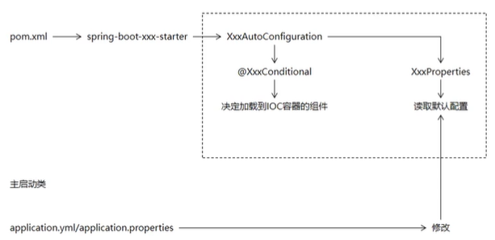

### 注解`@SpringBootApplication`

Spring Boot应用标注在某个类上说明这个类是`SpringBoot`的主配置类，`SpringBoot`就应该运行这个类的main方法来启动`SpringBoot`应用

#### 其包含的注解

- `@Configuration`：配置类上来标注这个注解
- `@EnableAutoConfiguration`：开启自动配置功能；
- `@AutoConfigurationPackage`：自动配置包，将主启动类包和它的子包中的所有组件扫描到IOC容器

### `SpringApplication`的run方法

启动程序，加载配置文件，加载容器。**主启动类所在的包及其子包都会被自动扫描**

主启动类上使用@ComponentScan时会使用设置的位置扫描，此时规约失效

### `spring-boot-starter-parent`

在pom.xml中配置，继承自`spring-boot-dependencies`，该工程管理着springboot的依赖

该包是项目的父工程

# Spring Boot启动流程

### 1.读取spring.factories文件

- 会读取spring-boot-autoconfigure.jar包下的META-INF/spring.factories文件。
- 读取其中EnableAutoConfiguration属性的值加载自动配置类。里面包括比如redis，mongo等很多库的

### 2.加载XxxProperties类(组件的默认配置)

- 根据自动配置类中指定的类设置自动配置的属性值

- 也可以根据XxxProperties类中指定的属性在yml配置文件中修改自动配置

- Properties就是通过`@ConfigrationPrpperties`的prefix来加载值，后面Yaml配置中的例子就是这么加载的。里面提供了默认的值

  > starter->XXxAutoConfiguration->XxxProperties->default config

### 3.根据@ConditionalXxx注解决定加载哪些组件

- SpringBoot通过@ConditionalXxx注解指定特定组件加入IOC容器时所需要具备的特定条件。
- 组件满足就添加IOC容器

### 配置流程

