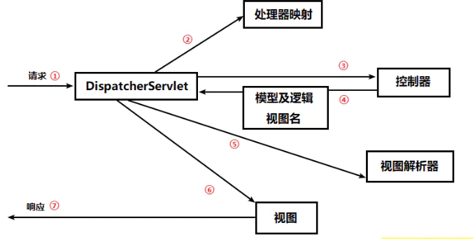

1. #### DispatcherServlet 会拦截所有的请求，并且将这些请求发送给 Spring MVC 控制器

2. #### DispatcherServlet 会查询一个或多个处理器映射来确定请求的下一站在哪里，处理器映射会根据请求所携带的 URL 信息来进行决策

3. #### 一旦选择了合适的控制器， DispatcherServlet 会将请求发送给选中的控制器，到了控制器，请求会卸下其负载（用户提交的请求）等待控制器处理完这些信息

4. #### 当控制器在完成逻辑处理后，通常会产生一些信息，这些信息就是需要返回给用户并在浏览器上显示的信息，它们被称为模型（Model）。仅仅返回原始的信息时不够的——这些信息需要以用户友好的方式进行格式化，一般会是 HTML，所以，信息需要发送给一个视图（view），通常会是 JSP。

5. #### 这样以来，控制器就不会和特定的视图相耦合，传递给 DispatcherServlet 的视图名并不直接表示某个特定的 JSP。（实际上，它甚至不能确定视图就是 JSP）相反，它传递的仅仅是一个逻辑名称，这个名称将会用来查找产生结果的真正视图。DispatcherServlet 将会使用视图解析器（view resolver）来将逻辑视图名匹配为一个特定的视图实现，它可能是也可能不是 JSP

6. #### 既然 DispatcherServlet 已经知道由哪个视图渲染结果了，那请求的任务基本上也就完成了。它的最后一站是视图的实现，在这里它交付模型数据，请求的任务也就完成了。视图使用模型数据渲染出结果，这个输出结果会通过响应对象传递给客户端。

## 什么说Spring MVC

Spring的web框架围绕DispatcherServlet设计，DispatcherServlet的作用是将请求分发到不同的处理器中以请求为驱动，围绕一个中心Servlet分派请求及提供其他功能，DispatcherServlet是一个实际的Servlet