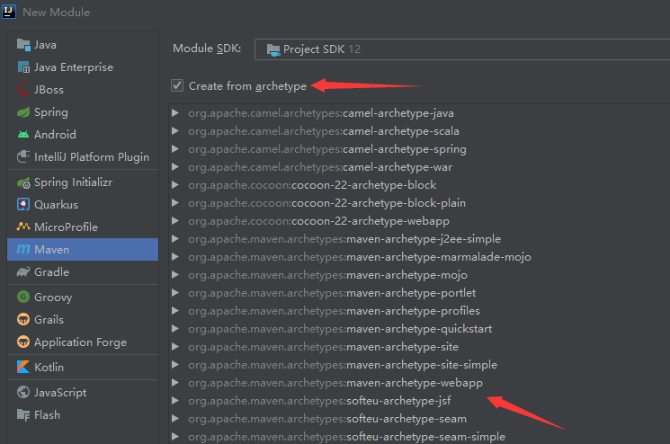
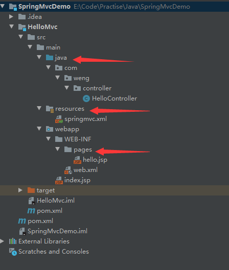
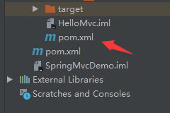
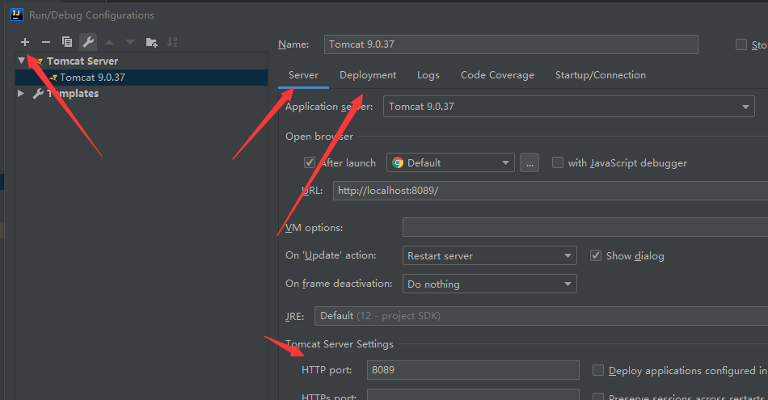
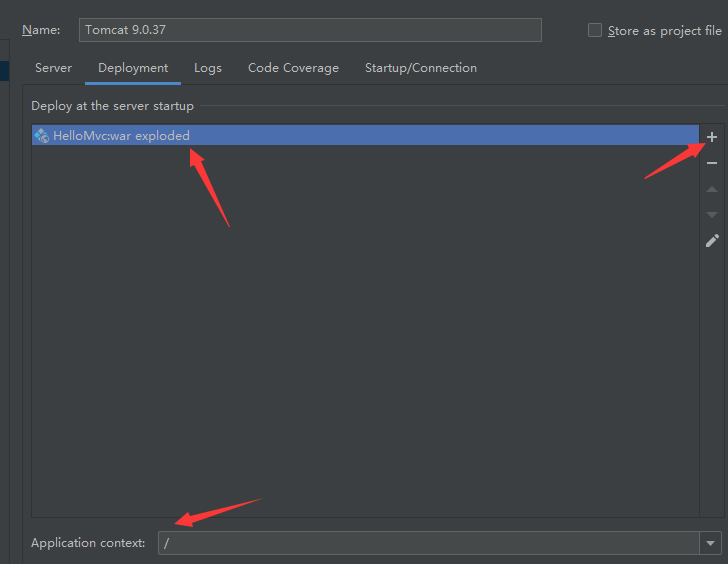

### 1.创建maven项目

### 2.通过模板创建springmvc项目



### 3.补全项目结构



### 4.在子项目中添加依赖



```
<properties>
  <project.build.sourceEncoding>UTF-8</project.build.sourceEncoding>
  <maven.compiler.source>1.8</maven.compiler.source>
  <maven.compiler.target>1.8</maven.compiler.target>
  <spring-version>5.1.9.RELEASE</spring-version>
</properties>


<dependencies>
  <dependency>
    <groupId>junit</groupId>
    <artifactId>junit</artifactId>
    <version>4.11</version>
    <scope>test</scope>
  </dependency>
  <dependency>
    <groupId>org.springframework</groupId>
    <artifactId>spring-context</artifactId>
    <version>${spring-version}</version>
  </dependency>
  <dependency>
    <groupId>org.springframework</groupId>
    <artifactId>spring-web</artifactId>
    <version>${spring-version}</version>
  </dependency>
  <dependency>
    <groupId>org.springframework</groupId>
    <artifactId>spring-webmvc</artifactId>
    <version>${spring-version}</version>
  </dependency>
  <dependency>
    <groupId>javax.servlet</groupId>
    <artifactId>servlet-api</artifactId>
    <version>2.5</version>
    <scope>provided</scope>
  </dependency>
  <dependency>
    <groupId>javax.servlet.jsp</groupId>
    <artifactId>jsp-api</artifactId>
    <version>2.0</version>
    <scope>provided</scope>
  </dependency>
</dependencies>
```

编写后通过maven下载包

### 5.编写web.xml文件

```
<web-app>
    <display-name>Archetype Created Web Application</display-name>


    <servlet>
        <!-- 使用系统的DispatcherServlet -->
        <servlet-name>dispatcherServlet</servlet-name>
        <servlet-class>org.springframework.web.servlet.DispatcherServlet</servlet-class>
        <!--  spring配置文件所在位置  -->
        <init-param>
            <param-name>contextConfigLocation</param-name>
            <param-value>classpath:springmvc.xml</param-value>
        </init-param>
        <!-- serlet加载顺序 -->
        <load-on-startup>1</load-on-startup>
    </servlet>
    <servlet-mapping>
        <servlet-name>dispatcherServlet</servlet-name>
        <url-pattern>/</url-pattern>
    </servlet-mapping>
</web-app>
```

### 6.在resources文件夹中创建spring配置文件(上面的配置中文件名为springmvc)

### 7.编写spring配置文件

```
<?xml version="1.0" encoding="UTF-8"?>
<beans xmlns="http://www.springframework.org/schema/beans"
        xmlns:xsi="http://www.w3.org/2001/XMLSchema-instance"
        xmlns:context="http://www.springframework.org/schema/context"
        xmlns:mvc="http://www.springframework.org/schema/mvc"
        xsi:schemaLocation="http://www.springframework.org/schema/beans
        http://www.springframework.org/schema/beans/spring-beans.xsd
        http://www.springframework.org/schema/context http://www.springframework.org/schema/context/spring-context.xsd
        http://www.springframework.org/schema/mvc http://www.springframework.org/schema/mvc/spring-mvc.xsd">


    <context:component-scan base-package="com.weng.controller"></context:component-scan>


    <!--视图解析器:DispatcherServlet给他的ModelAndView-->
    <bean class="org.springframework.web.servlet.view.InternalResourceViewResolver" id="InternalResourceViewResolver">
        <!--前缀-->
        <property name="prefix" value="/WEB-INF/pages/"/>
        <!--后缀-->
        <property name="suffix" value=".jsp"/>
    </bean>


    <mvc:annotation-driven></mvc:annotation-driven>


</beans>
```

### 8.创建一个Controller

```
@Controller
public class HelloController {


    @RequestMapping(path = "/hello", method = RequestMethod.GET)
    public String sayHello() {
        System.out.println("sayHello");
        return "hello";
    }
}
```

### 9.在pages文件夹中创建jsp文件

### 10.配置tomcat





配置deployment注意要选择exploded


