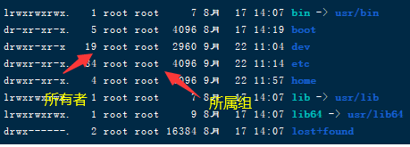

### `ls`

#### 功能：显示文件列表

#### 格式：ls [参数]

#### 参数：

- `-a`

>  显示所有文件，包括隐藏文件

- `-l`

> 详细信息显示
>
> 

- `-h`

> 人性化显示，可以将第五列的文件大小转成`kb`，`mb`
>
> 这是个通用参数，可以在任何显示大小的命令上使用

- `-d` 

> 查看目录属性
>
> 例如： `ls -ld /etc`即只查看`etc`的目录，不会显示其下属的文件/文件夹信息

Linux的文件没有创建时间，所有显示的时间都是修改时间

- `-i`

> 显示文件/文件夹的id号

#### 文件权限说明

### `mkdir`

#### 功能：创建目录

#### 格式：`mkdir` [参数] [目录名]

#### 参数：

- `-p`

> 递归创建

> 示例：`mkdir -p /home/test01 /home/test02`支持一个命令创建多个目录

### `cd`

#### 功能：改变目录

#### 格式：cd [目录]

#### 特殊目录：

- `/` 根目录
- `./` 当前目录
- `../` 父级目录

### `pwd`

#### 功能：显示当前目录路径

### `rmdir`

#### 功能：删除空目录

#### 格式：`rmdir` [目录名]

### `cp`

#### 功能：复制文件/目录

#### 格式：`cp`[参数] [原文件或目录] [目标目录]

#### 参数：

- -`r`

> 复制目录。复制文件时不需要加这个参数

- -`p`

> 保留文件属性。即复制的文件/目录的修改时间会保留而不会随复制而改变

复制的同时可以改名,当你的目标目录不存在时就被认定时复制并重命名

### `mv`

#### 功能：移动|截切|改名文件/目录

#### 格式：mv [原文件或目录] [目标目录]

> 不需要加-r这样的参数

### `rm`

#### 功能：删除文件/目录

#### 格式：`rm` [参数] [目录名]

#### 参数：

- -`r`

> 删除目录

- -`f`

> 强制执行，不会有询问确认信息

### `touch`

#### 功能：创建空文件

#### 格式：touch [文件名]

> 示例：touch “program files”可以创建带空格的文件名，但不推荐

### `cat`

#### 功能：查看文件内容

#### 格式：cat [文件名]

#### 参数：

- -`n`

> 显示行号，内容前面会有一个行号

用来查看内容比较少的内容

### `tac`

#### 功能：查看文件内容(倒序)

#### 格式：`tac `[文件名]

#### 

### `more`

#### 功能：以分页形式查看内容

#### 格式：`more` [文件名]

#### 进入more状态时的操作

- 空格/f -> 翻页
- 回车 -> 换行
- q/Q -> 退出

### `less`

#### 功能：以分页形式查看内容，与more相同但增加了向上翻页

#### 格式：`less` [文件名]

#### 进入`less`状态时的操作(其他与more一样)

- `pageup`键  -> 一页页向上翻
- 方向键↑  -> 一行行向上翻
- /关键字  - > 可以进行搜索，关键字会高亮显示
- n -> 在搜索状态下可以跳转到下一个符合的位置(next的意思)

### `head`

#### 功能：查看文件前几行数据

#### 格式：head [文件名]

#### 参数：

- -`n`

> 指定行数,不填默认10行

> 示例: head -n 20 `/etc/service`

### tail

#### 功能：查看文件末尾几行数据

#### 格式：tail [文件名]

#### 参数：

- -`n`

> 指定行数,不填默认10行

- -f

> ###### 动态显示文件末尾内容，多用于日志

### ln

#### 功能：链接文件

#### 格式：ln -s [原文件] [目标文件]

#### 参数：

- -s

> 生成软链接

> 示例：
>
> 生成软链接：`ln -s /etc/issue /tmp/issue.soft` 
>
> 生成硬链接：`ln /etc/issue /tmp/issue.hard`

#### 软链接与硬链接区别

- 软链接：文件类型为`l`，权限为三个`rwx`(即针对所有人有读写执行权限)，功能类型于windows的快捷方式，所以真正执行权限由源文件的权限决定。如果源文件被删除会软链接提示找不到。
- 硬链接：与源文件属性完全一样(包括文件大小)，类似执行了拷贝操作(执行cp -p操作)，唯一不同的是源文件发生更改时硬链接也会同步更改。如果源文件被删除硬链接可以照常访问，因为文件id号硬链接与源文件是一样的

- 硬链接不能跨分区，软链接可以

- 硬链接不能针对目录使用，只能针对文件

