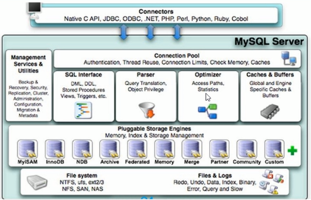
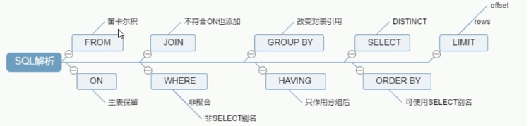
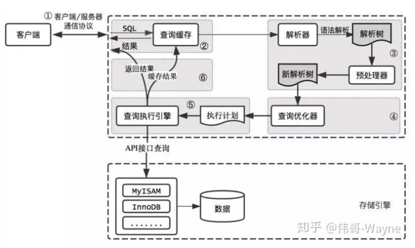

# MySQL中的组件



- **Connector:**提供第三方连接
- **SQL Interface:** SQL语句
- **Parser**: SQL语句转换器(转成引擎可识别的语句)
- **Optimizer**:语句优化器。遇到极端情况需要重写优化器Cache，buffers：缓存
- **Storage Engines：**数据库引擎。为了适应不同都情况要使用不同都引擎。比方就是车在山地，沙漠，城市用都引擎都不一样

**整个Mysql分为：**连接层，服务层，引擎层，存储层


# MySQL引擎

```mysql
Show engine //显示所有引擎
```

```mysql
show variables like '%storage_engine%' //通过查询当前引擎
```

### MySQL引擎类别

- MyISAM(适合查询)
- InnoDB(适合写)
- Percona(提升了高负载下InnoDB性能,AliSql就是基于这个修改)
- xtradb(号称可以完全替代InnoDB)


# SQL语句执行顺序

1. **FROM** <left table>
2. **ON** <Join condition>
3. <join type> **Join** <right table>
4. **Where** <where condition>
5. **Group by** <group by list>
6. **Having** <having condition>
7.  **select**
8. **distinct** <select list>
9. **order by** <order by condition>
10. **limit** <limit number>







