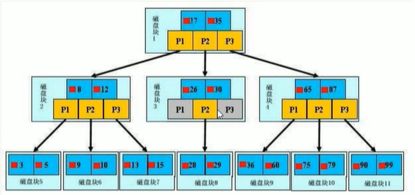

# 什么是索引

在数据之外，数据库系统还维护着满足特定查找算法的数据结构，这些数据结构以某种方式引用(指向)数据，这种数据结构就是索引。

类比字典。也可以理解为"排好序的快速查找数据结构"

#### 索引的其他因素

- 索引影响方面：**查询效率**，**排序**
- MySQL三百万数据性能开始下降
- 程序中为了未来的数据分析和保证索引不会进行物理删除
- 如果物理删除后索引会导致查找指定位置时没有得到正确的数据而导致索引失效，需要重新创建索引才能解决这个问题
- 我们常说的索引一般都是指B树索引。其中聚集索引，次要索引，覆盖索引，复合索引，前缀索引默认都是B树索引。此外还有哈希索引

### 索引优势

- 提高数据检索效率，降低数据库IO成本
- 降低数据排序成本，降低了CPU的消耗

### 索引劣势

- 索引也是一张表，需要占用磁盘空间
- 索引会大大提高查询速度，但会降低更新表速度(insert,update,delete)。因为每次都要调整索引
- 数据量的表索引需要根据业务。如果业务调整了索引经常需要重建。不断试错才能建立最适合的索引

[^建议单表的索引不要超过五个，因为同时间索引只有一个生效]: 

### 索引分类

- **单值索引：**一个索引只包含一个列。针对经常查询的列才建单值索引
- **唯一索引:** 索引值必须唯一但允许空值
- **复合索引：**一个索引包含多个列

### 索引结构

- B树索引(非DBA只要懂B树)
- 哈希索引
- 全文索引
- R-tree索引

# B树索引

浅蓝色是磁盘块，深蓝色是数据，黄色是指针

以磁盘块1为例：P1代表小于17的指针，P2代表大于17小于35的指针，P3代表大于35的指针。具体的数据在**最下层的叶子节点**中。非叶子节点中的值不一定是一个真实存在的值，主要是**用于指引搜索方向**。每次搜索加载一次磁盘块，最终获取到搜索的值时进行了三次IO操作。所以设计上尽量**让层级少**。三层B树可以表示**上百万**的数据如果没有索引查询一次数据就要一次IO，上百万的数据就要进行上百万的IO操作

# 适合建立索引的场景

- 主键(自动建立索引)
- 频繁作为查询条件的列
- 查询中与其他表关联的字段，外键关系建立索引
- 高并发下倾向创建组合索引(单键用于单个列频繁查询的)
- 查询中需要排序的字段。会提升排序速度
- 查询中统计或者分组的字段

# 不适合建立索引的场景

- 频繁更新的字段(针对需要删除的字段使用软删除来解决问题)
- where条件里用不到的字段
- 数据重复且分布平均的字段(建索引效果不大，例如true和false)

