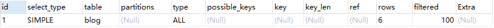

# 常见性能问题

- CPU:CPU在饱和的时候一般发生在数据装入在内存或从磁盘上读取数据时候
- IO:磁盘I/O瓶颈发生在装入数据远大于内存容量时
- 服务器硬件的性能瓶颈：top,free,iostat和vmstat来查看系统的性能状态


通过使用explain关键字可以模拟优化器执行SQL语句，直到MySQL如何处理你的SQL语句。分析你的查询语句或者表结构的性能瓶颈

```mysql
explain [SQL语句]
```


# explain的作用

- 表的读取顺序
- 数据读取操作的操作类型
- 哪些索引可以使用
- 哪些索引实际使用
- 表之间的引用
- 每张表有多少行被优化器查询

##### explain结果列示例




## explain列的解释

### id(执行顺序)

select查询的序列号，包含一组数字，表示查询中执行select子句或操作表的顺序。上面是单个查询所以只有一个，联表查询就会出现多个

- **id相同：**执行顺序由上至下，table表执行的顺序
- **id不同：**一般是子查询的情况**。**id的需要会递增，id值越大优先级越高，越先被执行。
- **id既有相同又有不同：**数字大的执行，数字相同的顺序执行


### select_type(查询语句类型)

- **SIMPLE**:简单查询，不包含子查询或union
- **PRIMARY**:查询中若包含任何复杂的子部分，最外层查询标记的
- **SUBQUERY**:在select或where列表中包含了子查询
- **DERIVED：**在from列表中包含的子查询被标记为DERIVED。Mysql会将子查询的结果放到**临时表**中
- **UNION:** 若第二个select出现在union之后则会被标记union。若union包含在from子句的子查询中，外层select将被标记为DERIVED
- **UNION RESULT:**从UNION表获得结果的select


### Table(表名)

- **DERIVED:衍生表,**一般都是虚表即通过子查询合成的一张表。后面的数字即对应的id


### Type(查询类型)

显示查询使用了何种类型。从最好到最差依次是：**system>const>eq_ref>ref>range>index>ALL**

- #### system

  - 表只有一行记录，const类型的特例。基本不会出现

- #### const

  - 表示通过索引一次就能找到，const用于比较primary key或者unique索引
  - 因为**只匹配一行记录**，所以很快如将主键置于where列表中，Mysql就能将该查询转换为一个常量。（注意where后面是常量）
  - 例如：select * from (select * from t1 where id=1) d1;

- #### eq_ref

  - 唯一性索引扫描，对于每个索引键，表中**只有一条**记录与之匹配。常见于主键或唯一索引扫描
  - 非常量但通过主键查询，const是具体值
  - 例如：select * from t1,t2 where t1.id=t2.id

- #### ref

  - 非唯一性索引扫描。返回符合的所有行，查询的值不管是变量还是常量
  - 与上面的区别就是eq_ref查询的是老板(只有一个)，ref查询的是员工(多个)

- #### range

  - 只检索给定范围的行，使用一个索引来选择(key列中显示使用了哪个索引)。一般是where中出现**between，<,>,in**等查询。从开始的索引到结束索引中进行查找，比全表好

- #### index

  - 只遍历索引树。虽然和all一样都是读全表，但index是从索引中读，all是从硬盘中读
  - 例如：select id from t1；id有索引

- #### ALL

  - 表明全表扫描，如果数据量大需要建索引


### possible_keys(待使用的索引)

- 查询涉及到的字段上存在的索引将被列出，但不一定被查询实际用到


### keys(实际使用的索引)

- 实际使用的索引，若为null代表没有索引。用于查询索引是否失效
- 覆盖索引即我查询的字段正好都建了索引，虽然possible_keys中没有索引，但key中用到了索引。即type为index的情况时出现


### key_len(查询中使用的索引长度)

- 表示索引中使用的字节数,可通过该列计算查询中使用的索引长度，在不损失精度的情况下越短越好
- 显示的值为索引字段的最大可能长度，并非实际使用长度。根据表定义计算出而不是表内实际的数据检索出
- and条件拼接的越多该数值越大，结果越精确


#### ref

- 显示索引的哪一列被使用了，如果可能的话，是一个常量。哪些列或常量被用于查找索引列上的值
- 格式：XX库.XX表.XX列。如果查询的是一个常量如id=1则显示为const


### rows

- 大致估算的所需的记录所需要读取的行数。即被优化器实际查询的数据量（并不是结果而是查询结果时读取的数据量）


### Extra

包含不适合放在其他列但又很**重要**的额外信息

- **Using filesort**

  - 说明mysql会对数据使用一个外部的索引排序，而不是按照表内的索引顺序进行读取
  - 即mysql中无法使用索引的排序称为“文件排序”
  - 遇到这个情况说明内部索引用于了查询但没有用于排序，导致性能下降。mysql需要通过文件系统自己排序
  - 比方：建立了(a2,a3)列的复合索引，但排序时**只**按照a2或a3来排序

- **Using temporary**

  - 产生了临时表保存中间结果。常见于order by和group by
  - 所以在进行排序和分组操作时，**创建的索引中列与顺序要与排序和分组中相同**
  - 比如：创建了(a2,a3)的复合索引，group by a3,a2就会出现Using filesort和Using temporary
  - 同样出现这个情况会增加数据库负担，性能下降

- **Using Index**

  - 表示相应的select操作中使用了覆盖索引，避免访问了表的数据行，效率高
  - 如果同时出现using where，表明索引被用来执行索引键值的**查找**
  - 如果没有出现using where，表面索引用来读取数据而**非执行查询**动作

- **Using Where**

  - 表面使用了where过滤

- **Using Join Buffer**

  - 使用了连接缓存

- **impossible where**

  - where 子句的值始终是false，不能获取到数据

- **select tables optimized away**

  - 在没有GROUPBY子句的情况下，基于索引优化MIN/MAX操作或者
    对于MyISAM存储引擎优化COUNT(*)操作，不必等到执行阶段再进行计算，
    查询执行计划生成的阶段即完成优化。

- **distinct**

  - 优化distinct，在找到第一匹配的元组后即停止找同样值的工作

  

### 覆盖索引

- select的数据列只用从索引中就能取得，不必查询数据行。不需要根据索引再次读取数据文件
- 例如：创建(c1,c2,c3)的索引，select c1,c2,c3 from t 就是用到了覆盖索引


#### **通过不断的分析创建你真正需要的索引**


