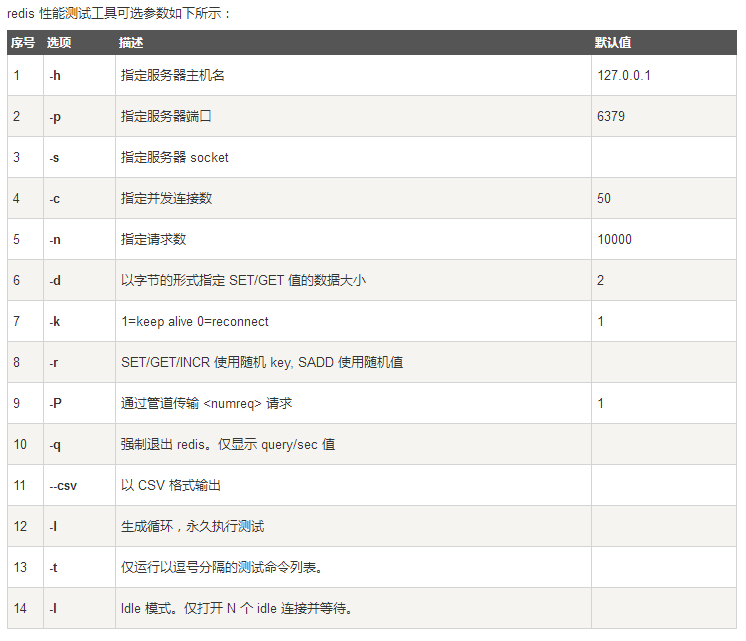

> 使用redis自带的redis-benchmark进行测试



示例

```
redis-benchmark -h 127.0.0.1 -p 6379 -c 50 -n 10000 -t get
```

> 这里测试get命令，需要加上-t参数。如果需要测试全部命令可以不加-t get

#### 测试结果

```
====== GET ======
  10000 requests completed in 0.17 seconds
  50 parallel clients
  3 bytes payload
  keep alive: 1

98.07% <= 1 milliseconds
100.00% <= 2 milliseconds
60240.96 requests per second
```

> ====== GET ======：代表测试的命令
>
> 10000 requests：10000次请求
>
> 50 parallel clients：50个并发客户端
>
> 3 bytes payload：每次读取/写入3个字节。可以通过-d命令修改包大小
>
> keep alive 1：只有一个服务器接收
>
> 98.07% <= 1 milliseconds：1毫秒内处理了98.07%的请求
>
> 100.00% <= 2 milliseconds：2毫秒内全部处理完成
>
> 60240.96 requests per second：每秒处理60240.96 个请求