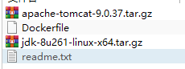

### 创建一个自己的tomcat镜像

```dockerfile
FROM centos
MAINTAINER wenghuacheng<593103283@qq.com> 
#拷贝一个读我文件，演示copy命令
COPY readme.txt /usr/local/readme.txt

ADD jdk-8u261-linux-x64.tar.gz /usr/local/
ADD apache-tomcat-9.0.37.tar.gz /usr/local/

RUN yum -y install vim

ENV MYPATH /usr/local
WORKDIR $MYPATH

#配置jdk环境变量。下载后可以看一下解压的文件夹名称[jdk1.8.0_261]
#CLASSPATH是冒号隔开,windows才是分号
ENV JAVA_HOME /usr/local/jdk1.8.0_261
ENV CLASSPATH $JAVA_HOME/lib/dt.jar:$JAVA_HOME/lib/tools.jar
#tomcat环境变量
ENV CATALINA_HOME /usr/local/apache-tomcat-9.0.37
ENV CATALINA_BASE /usr/local/apache-tomcat-9.0.37
#配置path
ENV PATH $PATH:$JAVA_HOME/bin:$CATALINA_HOME/lib:$CATALINA_HOME/bin

EXPOSE 8080

#启动tomcat
CMD /usr/local/apache-tomcat-9.0.37/bin/startup.sh && tail -f /usr/local/apache-tomcat-9.0.37/logs/catalina.out
```

> 如果文件名是Dockerfile就不用指定-f参数
>
> && tail -f /usr/local/apache-tomcat-9.0.37/bin/logs/catalina.out 是拼接命令，为了查看启动结果.如果不加会出现启动容器后闪退

#### 创建镜像

```
docker build -t mytomcat .
```



#### 创建容器

```shell
docker run -d -p 9090:8080 --name mytomcat -v /home/weng/build/tomcat/webapps:/usr/local/apache-tomcat-9.0.37/webapps -v  /home/weng/build/tomcat/tomcatlogs:/usr/local/apache-tomcat-9.0.37/logs mytomcat
```


#### 部署自己的应用 

1. 在宿主机的webapp的数据卷目录中创建test文件夹
2. 里面放入一个index.html文件
3. 浏览器中访问ip:9090/test会出现你的html页面


### 发布镜像到dockerhub

> 需要注册自己的账号
>
> 因为是外网非常慢

#### 登陆

```
docker login -u [用户名] -p [密码]
```

#### 提交镜像

```shell
docker pull 作者名/镜像名:版本号  #推荐做法，否则大家都叫一个名字
```

> docker pull weng/mytomcat:1.0
>


### 发布镜像到阿里云镜像服务


1. #### 创建命名空间

2. #### 创建镜像仓库

> 创建仓库时选择击本地仓库，再创建
>
> 1Mb云服务器上传速度很慢

点击进入仓库后可以看到pull流程，傻瓜式操作，一步步执行就好了

```
$ sudo docker tag [ImageId] registry.cn-hangzhou.aliyuncs.com/wenghuacheng/weng_test:[镜像版本号]
$ sudo docker push registry.cn-hangzhou.aliyuncs.com/wenghuacheng/weng_test:[镜像版本号]
```

> [镜像版本号]就是镜像名加版本好
>
> 示例
>
> ```
> sudo docker tag 37bb9c63c8b2 registry-vpc.cn-hangzhou.aliyuncs.com/acs/agent:tomcat01
> sudo docker push registry-vpc.cn-hangzhou.aliyuncs.com/acs/agent:tomcat01
> ```


